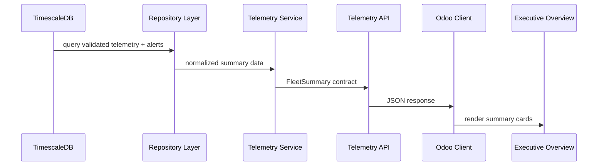
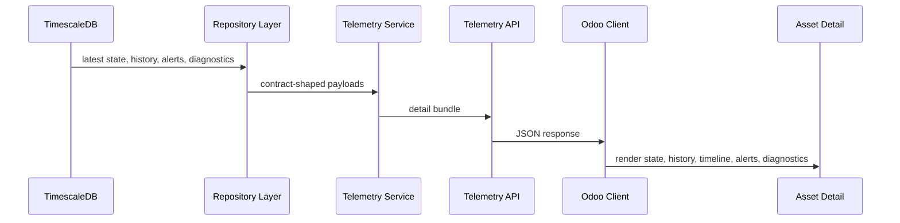

# Telemetry API Contracts

## Architecture
TimescaleDB -> Repository Layer -> Telemetry Service Layer -> Telemetry API -> Odoo API Client -> Odoo Models -> Asset Detail -> Cockpit Screens

## Hard Rules
- Odoo must not query TimescaleDB directly.
- No synthetic KPIs.
- Only validated FMC003 fields may be exposed in phase 1 and phase 2.
- Vehicle Diagnostics must be versioned and extensible.
- Unknown diagnostics fields must remain accessible through `raw_payload`.
- Do not build a temporary history wizard.
- Build the Asset Detail foundation directly.
- UI work starts only after API contracts are frozen.

## Endpoint List
- `GET /telemetry/fleet/summary`
- `GET /telemetry/latest`
- `GET /telemetry/vehicles/:device_id/history`
- `GET /telemetry/vehicles/:device_id/timeline`
- `GET /telemetry/vehicles/:device_id/alerts`
- `GET /telemetry/vehicles/:device_id/diagnostics`
- `GET /telemetry/vehicles/:device_id/detail`

## Request Schemas

### Fleet Summary
- Query params
  - `active_window_minutes` integer optional
  - `from` ISO 8601 optional
  - `to` ISO 8601 optional
  - `severity` string optional
- Body: none

### Latest Vehicle State
- Path params
  - `device_id` string required
- Query params: none

### Vehicle History
- Path params
  - `device_id` string required
- Query params
  - `from` ISO 8601 optional
  - `to` ISO 8601 optional
  - `limit` integer optional
  - `cursor` string optional

### Vehicle Timeline
- Path params
  - `device_id` string required
- Query params
  - `from` ISO 8601 optional
  - `to` ISO 8601 optional
  - `limit` integer optional
  - `cursor` string optional

### Vehicle Alerts
- Path params
  - `device_id` string required for device-scoped queries
- Query params
  - `from` ISO 8601 optional
  - `to` ISO 8601 optional
  - `severity` string optional
  - `alert_type` string optional
  - `acknowledged` boolean optional
  - `limit` integer optional
  - `cursor` string optional

### Vehicle Diagnostics
- Path params
  - `device_id` string required
- Query params
  - `from` ISO 8601 optional
  - `to` ISO 8601 optional
  - `limit` integer optional
  - `cursor` string optional
  - `version` string optional

### Asset Detail
- Path params
  - `device_id` string required
- Query params
  - `from` ISO 8601 optional
  - `to` ISO 8601 optional
  - `history_limit` integer optional
  - `timeline_limit` integer optional
  - `alerts_limit` integer optional
  - `diagnostics_limit` integer optional

## Response Schemas

### Latest Vehicle State
```json
{
  "device_id": "string",
  "event_id": "string",
  "timestamp": "2026-06-03T11:59:50Z",
  "received_at": "2026-06-03T11:59:51Z",
  "lat": 36.82,
  "lng": 10.166,
  "altitude": 120,
  "accuracy": null,
  "bearing": 45,
  "speed": 72,
  "ignition": true,
  "fuel_level": 61.2,
  "odometer": 125440,
  "rpm": 1920,
  "engine_load": 34.5,
  "buffered": false,
  "payload": {}
}
```

### Vehicle History
```json
{
  "device_id": "string",
  "from": "2026-06-03T11:00:00Z",
  "to": "2026-06-03T12:00:00Z",
  "limit": 500,
  "next_cursor": null,
  "records": []
}
```

### Vehicle Timeline
```json
{
  "device_id": "string",
  "from": "2026-06-03T11:00:00Z",
  "to": "2026-06-03T12:00:00Z",
  "limit": 500,
  "next_cursor": null,
  "records": [
    { "kind": "telemetry", "source": "telemetry", "sequence": 1 },
    { "kind": "alert", "source": "alert", "sequence": 2 }
  ]
}
```

### Vehicle Alerts
```json
{
  "device_id": "string",
  "from": null,
  "to": null,
  "severity": null,
  "alert_type": null,
  "acknowledged": null,
  "limit": 100,
  "next_cursor": null,
  "records": []
}
```

### Vehicle Diagnostics
```json
{
  "version": "1",
  "device_id": "string",
  "latest": {
    "device_id": "string",
    "timestamp": "2026-06-03T11:59:50Z",
    "received_at": "2026-06-03T11:59:51Z",
    "rpm": 1920,
    "engine_load": 34.5,
    "fuel_level": 61.2,
    "odometer": 125440,
    "buffered": false,
    "payload": {}
  },
  "history": [],
  "raw_payload": {}
}
```

### Fleet Summary
```json
{
  "as_of": "2026-06-03T12:00:00Z",
  "active_window_minutes": 15,
  "totals": {
    "total_vehicles": 42,
    "active_vehicles": 11,
    "ignition_on": 11,
    "ignition_off": 31,
    "low_fuel": 3,
    "overspeed": 2,
    "buffered": 5
  },
  "quality": {
    "gps_valid": 40,
    "gps_invalid": 2,
    "gps_coverage_ratio": 0.952,
    "signal_quality_supported": false,
    "signal_quality": null,
    "signal_quality_reason": "validated ingestion path does not expose a stable signal quality field",
    "device_health_supported": true,
    "device_health": 0.952,
    "device_health_reason": "freshness and completeness ratio from validated fields"
  },
  "alerts": {
    "open_alerts": 7,
    "alert_count_by_severity": { "low": 2, "medium": 3, "high": 2, "critical": 0 },
    "alert_count_by_type": { "overspeed": 2, "low_fuel": 3, "geofence_breach": 2 }
  },
  "devices": {
    "fresh": 39,
    "stale": 3,
    "stale_threshold_minutes": 15
  }
}
```

## Sequence Diagrams

### Fleet Summary


### Asset Detail


## Implementation Notes
- Phase 1: repository layer, telemetry service layer, contract definitions.
- Phase 2: endpoints for summary, latest state, history, timeline, alerts, and diagnostics.
- Phase 3: Odoo API client and Odoo models consuming the contracts.
- Phase 4: Asset Detail page.
- Phase 5: cockpit overview screens.

## Files To Modify First
- `d:/pcf/fleet-telemetry/l4-service/src/telemetry-contracts.js`
- `d:/pcf/fleet-telemetry/l4-service/src/telemetry-repository.js`
- `d:/pcf/fleet-telemetry/l4-service/src/telemetry-service.js`
- `d:/pcf/fleet-telemetry/l4-service/src/api.js`
- `d:/pcf/fleet-telemetry/l4-service/src/index.js`

## Diagnostics Rule
Vehicle Diagnostics version 1 must preserve raw payload content. Unknown fields remain accessible through `raw_payload`; later versions may add typed fields without removing historical raw content.
