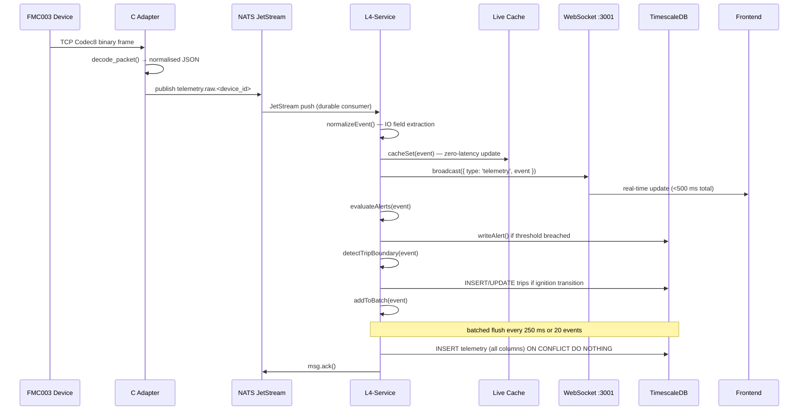
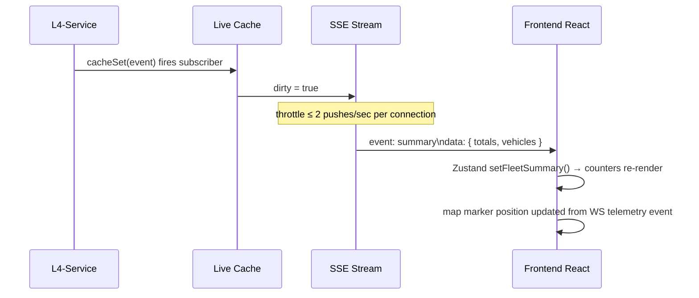
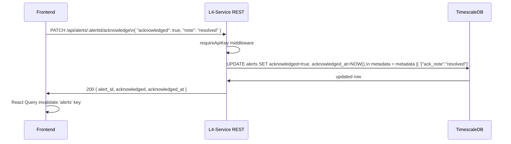

# Design Document — Fleet Telemetry Platform

## Overview

This document describes the technical architecture for the Fleet Telemetry Platform redesign. The
goal is to replace the Odoo 17 ERP presentation layer with a purpose-built Next.js frontend while
retaining every proven backend component unchanged or extended.

The current stack has a fully operational ingestion path:

```
FMC003 → TCP:18883 → C Adapter (Codec8 decoder) → NATS JetStream → L4-Service → TimescaleDB
```

The gaps are entirely in persistence completeness (IO fields stored in JSONB instead of dedicated
columns), missing domain tables (drivers, trips, DTC events, device config), an incomplete alert
engine (hardcoded geofence, missing alert types), and the absence of any purpose-built UI.

The redesign adds:
1. A migration script (`02_schema_v2.sql`) that extends the existing schema idempotently.
2. Extensions to `consumer.js`, `alerts.js`, and `api.js` inside L4-Service.
3. A new `frontend/` Next.js application added to Docker Compose.

Nothing in the ingestion path (adapter, NATS, TCP listener) is modified.

---

## Architecture

### System Topology

```
┌──────────────────────────────────────────────────────────────────────────────┐
│  FMC003 Devices (Teltonika GPS trackers)                                     │
│  Codec 8 / Codec 8E binary frames over TCP                                   │
└──────────────────────────────────────┬───────────────────────────────────────┘
                                       │ TCP :18883
                                       ▼
┌──────────────────────────────────────────────────────────────────────────────┐
│  fleet-adapter  (Docker: C binary + Node.js health/webhook)                  │
│  decoder.c  — Codec8 frame parser, IMEI extraction, IO map                   │
│  nats-pub.c — normalised JSON publisher to NATS                              │
│  adapter.js — HTTP :3000 health + Traccar-format webhook (dev only)          │
└──────────────────────────────────────┬───────────────────────────────────────┘
                                       │ NATS subject: telemetry.raw.<device_id>
                                       ▼
┌──────────────────────────────────────────────────────────────────────────────┐
│  fleet-nats  (NATS JetStream, stream: TELEMETRY, durable: l4-processor)     │
│  Retention: 7 days / file storage / 1 replica                                │
└──────────────────────────────────────┬───────────────────────────────────────┘
                                       │ JetStream consume (explicit ack)
                                       ▼
┌──────────────────────────────────────────────────────────────────────────────┐
│  fleet-l4-service  (Node.js ESM, ports 3000 REST + 3001 WS)                 │
│                                                                              │
│  consumer.js ── normalise ── cacheSet ── evaluateAlerts ── addToBatch       │
│  live-cache.js ── in-process Map + subscriber fan-out                        │
│  alerts.js ── cooldown maps, threshold evaluation, DB-backed geofences       │
│  api.js ── Express REST, WebSocket (ws), SSE stream                          │
│  telemetry-repository.js ── parameterised SQL, cursor pagination             │
│  telemetry-service.js ── business logic, contract shaping                   │
│  db.js ── pg Pool, writeTelemetryBatch, writeAlert, writeAuditLog           │
└────────────┬──────────────────────────────────────────────────────┬──────────┘
             │ pg Pool (port 5432)                                   │ WebSocket :3001
             ▼                                                       │ SSE :3000/api/stream/dashboard
┌────────────────────────────┐                                       │ REST :3000/api/*
│  fleet-timescaledb          │                                       ▼
│  PostgreSQL 16 + TimescaleDB│         ┌──────────────────────────────────────┐
│  hypertables:               │         │  fleet-frontend  (Next.js :4000)     │
│  - telemetry                │         │                                      │
│  - alerts                   │◄────────│  Pages: /, /vehicles/:id, /map,      │
│  - audit_log                │  DB API │  /alerts, /analytics, /devices       │
│  tables:                    │  calls  │                                      │
│  - devices                  │         │  Real-time: EventSource (SSE) +      │
│  - drivers                  │         │  WebSocket reconnect w/ backoff      │
│  - trips                    │         │                                      │
│  - dtc_events               │         │  Map: MapLibre GL JS + OSM tiles     │
│  - device_config            │         │  State: React Query + Zustand        │
│  - geofences                │         └──────────────────────────────────────┘
│  - geofence_assignments     │
│  views:                     │
│  - telemetry_hourly_summary │
│  - telemetry_daily_summary  │
└────────────────────────────┘
```

### Components Removed

| Component | Reason |
|---|---|
| `odoo` service | Replaced by `fleet-frontend` |
| `odoo-init`, `odoo-module-init` | Odoo init containers no longer needed |
| `odoo-db` (PostgreSQL 15) | Odoo database eliminated |
| `traccar` service | Codec 8 decoded by C adapter; Traccar redundant |
| `config/emqx/` | EMQX not wired into compose; artifacts only |
| `ALLOWED_ORIGINS` reference to `:8069` | Replaced by `:4000` |

---

## Components and Interfaces

### L4-Service Module Responsibilities

```
l4-service/src/
├── index.js               — process bootstrap, wires consumer + api
├── consumer.js            — NATS consume, normalise, cache, alert, batch-write
├── live-cache.js          — in-process Map, subscriber pattern, buildLiveSummary()
├── alerts.js              — threshold evaluation, cooldown, geofence, new alert types
├── api.js                 — Express REST, WebSocket, SSE, auth middleware
├── db.js                  — pg Pool, write helpers
├── telemetry-repository.js — parameterised SQL, cursor pagination queries
├── telemetry-service.js   — contract shaping, business logic
└── telemetry-contracts.js — response schema definitions
```

#### consumer.js Extensions

The existing `IO_MAP` and `normalizeEvent()` functions already extract all 18 new fields into the
event object. The only required change is `writeTelemetryBatch()` in `db.js` — the INSERT must
include all new columns in its column list. No changes to the normalization pipeline are needed.

Trip boundary detection is added as a side-effect of `normalizeEvent` output: after `cacheSet` and
before `addToBatch`, a `detectTripBoundary(event)` call compares the current `ignition` value
against the previous cached value to open or close a `trips` row.

DTC detection is similarly injected after normalization: a `detectDtcEvent(event)` function checks
for non-zero DTC IO fields and writes `dtc_events` rows.

```
NATS message
    │
    ▼  parse + normalizeEvent()   (existing)
    ├─► cacheSet()                (existing — live-cache updated before DB write)
    ├─► broadcast({ type: 'telemetry', event })   (existing)
    ├─► evaluateAlerts()          (extended — new alert types)
    ├─► detectTripBoundary()      (new — ignition transition detection)
    ├─► detectDtcEvent()          (new — DTC field detection)
    └─► addToBatch()              (extended — new columns in INSERT)
```

#### alerts.js Extensions

New alert evaluations added alongside existing ones:

| Alert Type | Trigger Condition | Severity | Cooldown |
|---|---|---|---|
| `harsh_braking` | `axis_x > 3000` AND `speed > 20 km/h` | HIGH | 60 s |
| `harsh_acceleration` | `axis_x > 3000` (positive accel context) AND `speed > 20 km/h` | MEDIUM | 60 s |
| `battery_low` | `bat_voltage < 3.0 V` | HIGH | 300 s |
| `power_disconnect` | `ext_voltage[prev] > 11.0` → `ext_voltage[curr] < 7.0` | CRITICAL | no reset until restored |
| `device_offline` | no event in 600 s with last `ignition = TRUE` | HIGH | persists until recovery |
| `geofence_exit` | position outside assigned geofence polygon | MEDIUM | 300 s |
| `geofence_enter` | position inside geofence after being outside | LOW | 300 s |

The hardcoded `GEOFENCE_BOUNDS` env-var rectangle evaluation is replaced by a DB-backed polygon
evaluation using a JavaScript point-in-polygon ray casting function. Geofences are loaded at
startup and refreshed on `NOTIFY fleet_geofence_change` via `pg`'s `LISTEN` mechanism.

`power_disconnect` requires tracking the previous `ext_voltage` per device — added to a bounded
Map alongside the existing `idleTimers` and `lastAlertAt` maps (capped at `MAX_TRACKED_DEVICES`).

`device_offline` uses a `setInterval` heartbeat running every 60 seconds that sweeps the live cache
for devices whose last event timestamp exceeds 600 seconds with `ignition = TRUE` cached.

#### api.js Extensions

New endpoints added to the existing Express router:

```
PATCH  /api/alerts/:alertId/acknowledge
GET    /api/alerts                          (fleet-scoped, filtered)
GET    /api/devices                         (full registry)
GET    /api/devices/:deviceId
POST   /api/devices
PATCH  /api/devices/:deviceId
GET    /api/devices/:deviceId/config
POST   /api/devices/:deviceId/config
GET    /api/drivers
POST   /api/drivers
PATCH  /api/drivers/:driverId
GET    /api/drivers/:driverId
GET    /api/vehicles/:deviceId/trips
GET    /api/trips/:tripId/route
GET    /api/vehicles/:deviceId/dtc
GET    /api/geofences
POST   /api/geofences
POST   /api/geofences/:geofenceId/assign
GET    /api/analytics/utilization
GET    /api/analytics/fuel
GET    /api/analytics/trips
```

All write endpoints (`POST`, `PATCH`) use `express.json()` and are protected by `requireApiKey`.
The existing `ALLOWED_ORIGINS` CORS middleware is updated to include `http://localhost:4000`.

#### live-cache.js Extensions

`buildLiveSummary()` is extended to include:
- `avg_bat_voltage` — mean across all cached vehicles
- `low_battery_count` — count where `bat_voltage < 3.0`
- `offline_count` — count where age > 600 s
- `unacknowledged_alerts` — injected from a fast in-memory counter maintained by `alerts.js`

The existing per-vehicle list already includes `bat_voltage`, `ext_voltage`, `movement`,
`gsm_signal`, `gnss_status`, `gnss_hdop`, `trip_odometer`, `eco_score`, `sleep_mode` from the
current `buildLiveSummary()` implementation.

### Frontend Architecture

```
frontend/
├── src/
│   ├── app/                       — Next.js 14 App Router
│   │   ├── layout.tsx             — Root layout, nav, toast provider
│   │   ├── page.tsx               — Fleet Overview (route: /)
│   │   ├── vehicles/
│   │   │   └── [deviceId]/page.tsx — Vehicle Detail
│   │   ├── map/page.tsx           — Fleet Map
│   │   ├── alerts/page.tsx        — Alerts Center
│   │   ├── analytics/page.tsx     — Analytics
│   │   ├── devices/page.tsx       — Device Management
│   │   └── api/
│   │       └── health/route.ts    — Next.js health API route (proxy to L4)
│   ├── components/
│   │   ├── map/
│   │   │   ├── FleetMap.tsx       — MapLibre GL JS wrapper
│   │   │   ├── VehicleMarker.tsx  — Coloured marker + popup
│   │   │   ├── MarkerCluster.tsx  — Cluster when > 20 vehicles in viewport
│   │   │   └── GeofenceOverlay.tsx — GeoJSON polygon layer
│   │   ├── vehicle/
│   │   │   ├── TelemetryCard.tsx  — Single field display card
│   │   │   ├── TelemetryGrid.tsx  — Card grid for Overview tab
│   │   │   ├── TripList.tsx       — Paginated trip table
│   │   │   ├── TripRouteMap.tsx   — Polyline route on mini-map
│   │   │   ├── AlertHistory.tsx   — Alert table with ACK button
│   │   │   └── DiagnosticsPanel.tsx
│   │   ├── alerts/
│   │   │   ├── AlertTable.tsx     — Sortable/filterable alert table
│   │   │   ├── AlertDrawer.tsx    — Detail drawer with mini-map
│   │   │   └── SeverityBadge.tsx
│   │   ├── analytics/
│   │   │   ├── UtilizationChart.tsx
│   │   │   ├── FuelChart.tsx
│   │   │   └── TripMetricsTable.tsx
│   │   ├── devices/
│   │   │   ├── DeviceTable.tsx
│   │   │   └── DeviceForm.tsx
│   │   └── shared/
│   │       ├── StatusCounter.tsx
│   │       ├── Pagination.tsx
│   │       └── DateRangePicker.tsx
│   ├── lib/
│   │   ├── api/
│   │   │   ├── client.ts          — Typed fetch wrapper with X-API-Key header
│   │   │   ├── fleet.ts           — Fleet / dashboard endpoints
│   │   │   ├── vehicles.ts        — Vehicle history, timeline, diagnostics
│   │   │   ├── alerts.ts          — Alert list, acknowledge
│   │   │   ├── trips.ts           — Trip list, route
│   │   │   ├── devices.ts         — Device CRUD
│   │   │   ├── drivers.ts         — Driver CRUD
│   │   │   ├── geofences.ts       — Geofence CRUD
│   │   │   └── analytics.ts       — Utilization, fuel, trip analytics
│   │   ├── realtime/
│   │   │   ├── useSSE.ts          — EventSource hook with reconnect
│   │   │   └── useWebSocket.ts    — WebSocket hook with exponential backoff
│   │   └── store/
│   │       └── vehicleStore.ts    — Zustand store: live vehicle positions + state
│   └── types/
│       └── telemetry.ts           — Shared TypeScript types from API contracts
├── public/
├── Dockerfile
├── next.config.ts
├── tsconfig.json
└── package.json
```

#### API Client Layer

All L4-Service calls flow through a single typed fetch wrapper in `lib/api/client.ts`:

```typescript
// lib/api/client.ts
const BASE_URL = process.env.NEXT_PUBLIC_API_URL ?? 'http://localhost:3000';
const API_KEY  = process.env.NEXT_PUBLIC_API_KEY  ?? '';

export async function apiFetch<T>(path: string, init?: RequestInit): Promise<T> {
  const res = await fetch(`${BASE_URL}${path}`, {
    ...init,
    headers: { 'X-API-Key': API_KEY, 'Content-Type': 'application/json', ...init?.headers },
  });
  if (!res.ok) throw new ApiError(res.status, await res.text());
  return res.json() as Promise<T>;
}
```

In production, write endpoints are proxied through Next.js API routes so the API key is not
exposed in the client bundle.

#### Real-Time Integration

Two connections are maintained simultaneously:

```
useSSE('/api/stream/dashboard')
  → on 'summary' event → Zustand vehicleStore.setFleetSummary()
  → on 'heartbeat'    → noop (connection keep-alive)

useWebSocket('ws://l4-service:3001')
  → on 'snapshot'    → vehicleStore.setAll()
  → on 'telemetry'   → vehicleStore.updateVehicle(event)
                       → map marker position updated < 500 ms
  → on 'alert'       → alertsStore.prepend(alert)
  → on 'close'       → exponential backoff (1s, 2s, 4s, … capped at 30s)
```

React Query is used for all REST endpoints (history, trips, analytics) providing caching,
background refresh, and loading/error states. Live vehicle positions come exclusively from the
WebSocket — no REST polling for live data while the connection is active.

---

## Data Models

### Migration Script: `init/timescaledb/02_schema_v2.sql`

All additions use `IF NOT EXISTS` / `DO $$ BEGIN … EXCEPTION WHEN duplicate_column THEN … END $$`
guards so the script is safely re-runnable on existing deployments.

#### Extended `telemetry` Columns

```sql
ALTER TABLE telemetry
  ADD COLUMN IF NOT EXISTS ext_voltage     FLOAT
    CONSTRAINT chk_ext_voltage     CHECK (ext_voltage     IS NULL OR (ext_voltage >= 0 AND ext_voltage <= 36)),
  ADD COLUMN IF NOT EXISTS bat_voltage     FLOAT
    CONSTRAINT chk_bat_voltage     CHECK (bat_voltage     IS NULL OR (bat_voltage >= 0 AND bat_voltage <= 5)),
  ADD COLUMN IF NOT EXISTS bat_level       INTEGER,
  ADD COLUMN IF NOT EXISTS bat_current     INTEGER,
  ADD COLUMN IF NOT EXISTS gnss_status     INTEGER,
  ADD COLUMN IF NOT EXISTS gnss_hdop       FLOAT,
  ADD COLUMN IF NOT EXISTS gnss_pdop       FLOAT,
  ADD COLUMN IF NOT EXISTS movement        BOOLEAN,
  ADD COLUMN IF NOT EXISTS gsm_signal      INTEGER,
  ADD COLUMN IF NOT EXISTS network_type    INTEGER,
  ADD COLUMN IF NOT EXISTS axis_x          INTEGER,
  ADD COLUMN IF NOT EXISTS axis_y          INTEGER,
  ADD COLUMN IF NOT EXISTS axis_z          INTEGER,
  ADD COLUMN IF NOT EXISTS trip_odometer   FLOAT,
  ADD COLUMN IF NOT EXISTS eco_score       FLOAT,
  ADD COLUMN IF NOT EXISTS fuel_rate_gps   FLOAT,
  ADD COLUMN IF NOT EXISTS fuel_used_gps   FLOAT,
  ADD COLUMN IF NOT EXISTS sleep_mode      INTEGER;

CREATE INDEX IF NOT EXISTS idx_telemetry_movement
  ON telemetry (device_id, movement);
CREATE INDEX IF NOT EXISTS idx_telemetry_bat_voltage
  ON telemetry (device_id, bat_voltage);
```

#### Extended `devices` Table

```sql
ALTER TABLE devices
  ADD COLUMN IF NOT EXISTS vin                 TEXT,
  ADD COLUMN IF NOT EXISTS iccid               TEXT,
  ADD COLUMN IF NOT EXISTS serial_number       TEXT,
  ADD COLUMN IF NOT EXISTS registration_number TEXT,
  ADD COLUMN IF NOT EXISTS make                TEXT,
  ADD COLUMN IF NOT EXISTS model               TEXT,
  ADD COLUMN IF NOT EXISTS year                INTEGER,
  ADD COLUMN IF NOT EXISTS fuel_type           TEXT,
  ADD COLUMN IF NOT EXISTS driver_id           UUID;

-- Unique constraints (nullable-safe)
CREATE UNIQUE INDEX IF NOT EXISTS idx_devices_vin   ON devices (vin)   WHERE vin IS NOT NULL;
CREATE UNIQUE INDEX IF NOT EXISTS idx_devices_iccid ON devices (iccid) WHERE iccid IS NOT NULL;
```

The `driver_id` foreign key to `drivers` is added after the `drivers` table is created.

#### `drivers` Table

```sql
CREATE TABLE IF NOT EXISTS drivers (
  driver_id   UUID        PRIMARY KEY DEFAULT gen_random_uuid(),
  name        TEXT        NOT NULL,
  employee_id TEXT        UNIQUE,
  license_number TEXT,
  phone       TEXT,
  tag_id      TEXT        UNIQUE,
  status      TEXT        NOT NULL DEFAULT 'active'
    CHECK (status IN ('active', 'inactive')),
  created_at  TIMESTAMPTZ NOT NULL DEFAULT NOW(),
  updated_at  TIMESTAMPTZ NOT NULL DEFAULT NOW()
);

ALTER TABLE devices
  ADD CONSTRAINT fk_devices_driver
  FOREIGN KEY (driver_id) REFERENCES drivers (driver_id) ON DELETE SET NULL;
```

#### `trips` Table

```sql
CREATE TABLE IF NOT EXISTS trips (
  trip_id               UUID             PRIMARY KEY DEFAULT gen_random_uuid(),
  device_id             TEXT             NOT NULL REFERENCES devices (device_id),
  driver_id             UUID             REFERENCES drivers (driver_id) ON DELETE SET NULL,
  started_at            TIMESTAMPTZ      NOT NULL,
  ended_at              TIMESTAMPTZ,
  start_lat             DOUBLE PRECISION,
  start_lng             DOUBLE PRECISION,
  end_lat               DOUBLE PRECISION,
  end_lng               DOUBLE PRECISION,
  distance_meters       INTEGER,
  duration_seconds      INTEGER,
  fuel_consumed_liters  FLOAT,
  max_speed_kmh         FLOAT,
  avg_speed_kmh         FLOAT,
  idle_seconds          INTEGER,
  eco_score             FLOAT,
  status                TEXT NOT NULL DEFAULT 'active'
    CHECK (status IN ('active', 'completed'))
);

CREATE INDEX IF NOT EXISTS idx_trips_device_started ON trips (device_id, started_at DESC);
SELECT add_retention_policy('trips', INTERVAL '365 days', if_not_exists => TRUE);
```

#### `dtc_events` Table

```sql
CREATE TABLE IF NOT EXISTS dtc_events (
  dtc_id      UUID        PRIMARY KEY DEFAULT gen_random_uuid(),
  device_id   TEXT        NOT NULL,
  timestamp   TIMESTAMPTZ NOT NULL,
  dtc_code    TEXT        NOT NULL,
  description TEXT,
  raw_value   INTEGER,
  resolved_at TIMESTAMPTZ,
  event_id    UUID
);

CREATE INDEX IF NOT EXISTS idx_dtc_device_ts ON dtc_events (device_id, timestamp DESC);
SELECT add_retention_policy('dtc_events', INTERVAL '365 days', if_not_exists => TRUE);
```

#### `device_config` Table

```sql
CREATE TABLE IF NOT EXISTS device_config (
  config_id                UUID        PRIMARY KEY DEFAULT gen_random_uuid(),
  device_id                TEXT        NOT NULL REFERENCES devices (device_id),
  firmware_version         TEXT,
  tracking_interval_seconds INTEGER,
  sleep_mode               INTEGER,
  config_applied_at        TIMESTAMPTZ NOT NULL DEFAULT NOW(),
  notes                    TEXT
);
```

#### Alert Schema Update

```sql
ALTER TABLE alerts DROP CONSTRAINT IF EXISTS alerts_severity_check;
ALTER TABLE alerts ADD CONSTRAINT alerts_severity_check
  CHECK (severity IN ('LOW', 'MEDIUM', 'HIGH', 'CRITICAL'));
```

#### `telemetry_daily_summary` Continuous Aggregate

```sql
CREATE MATERIALIZED VIEW IF NOT EXISTS telemetry_daily_summary
WITH (timescaledb.continuous) AS
SELECT
  time_bucket('1 day', timestamp)       AS day,
  device_id,
  AVG(speed)                            AS avg_speed,
  MAX(speed)                            AS max_speed,
  SUM(fuel_used_gps)                    AS total_fuel_used_gps,
  MAX(trip_odometer) - MIN(trip_odometer) AS total_distance,
  COUNT(*)                              AS event_count
FROM telemetry
GROUP BY day, device_id
WITH DATA;

SELECT add_continuous_aggregate_policy('telemetry_daily_summary',
  start_offset => INTERVAL '2 days',
  end_offset   => INTERVAL '1 hour',
  schedule_interval => INTERVAL '1 day',
  if_not_exists => TRUE
);
```

### Point-in-Polygon Algorithm

Geofence evaluation uses a standard ray casting implementation in JavaScript — no PostGIS required:

```javascript
// Returns true if [lat, lng] is inside the GeoJSON Polygon ring.
// Coordinates are [lng, lat] order per GeoJSON spec.
function pointInPolygon(lat, lng, ring) {
  let inside = false;
  for (let i = 0, j = ring.length - 1; i < ring.length; j = i++) {
    const [xi, yi] = ring[i]; // xi = lng, yi = lat
    const [xj, yj] = ring[j];
    const intersect =
      yi > lat !== yj > lat &&
      lng < ((xj - xi) * (lat - yi)) / (yj - yi) + xi;
    if (intersect) inside = !inside;
  }
  return inside;
}
```

This function is pure and stateless — ideal for property-based testing.

### Cursor Pagination

Cursors encode the last record's `(timestamp, event_id)` as a base64 JSON string:

```javascript
function encodeCursor(timestamp, eventId) {
  return Buffer.from(JSON.stringify({ t: timestamp, id: eventId })).toString('base64url');
}

function decodeCursor(cursor) {
  const { t, id } = JSON.parse(Buffer.from(cursor, 'base64url').toString('utf8'));
  return { timestamp: t, eventId: id };
}
```

SQL pagination uses a keyset condition:

```sql
WHERE (timestamp, event_id) < ($cursorTimestamp, $cursorEventId)
ORDER BY timestamp DESC, event_id DESC
LIMIT $limit
```

---

## Data Flow Diagrams

### Telemetry Ingestion (Happy Path)



### Fleet Overview Real-Time Update



### Alert Acknowledgement Flow



---

## API Design

### Authentication

All endpoints except `GET /health` require the `X-API-Key` header matching the `API_KEY`
environment variable. In production, `NODE_ENV=production` with no `API_KEY` returns `503` on all
protected routes.

The frontend uses Next.js API routes as a server-side proxy for write operations, keeping the API
key out of the client bundle.

### REST Endpoints (complete list)

#### Live / Cache Endpoints (no DB latency)

| Method | Path | Description |
|---|---|---|
| GET | `/health` | Service health: db, nats, cache_size |
| GET | `/api/dashboard/live` | Fleet summary from live cache |
| GET | `/api/vehicles/live` | All vehicles with latest state |
| GET | `/api/stream/dashboard` | SSE: `summary` events + heartbeats |

#### Telemetry History Endpoints

| Method | Path | Description |
|---|---|---|
| GET | `/api/fleet/summary` | DB-backed fleet summary (historical window) |
| GET | `/api/vehicles/:deviceId/latest` | Latest persisted state |
| GET | `/api/vehicles/:deviceId/history` | Paginated telemetry records |
| GET | `/api/vehicles/:deviceId/timeline` | Interleaved telemetry + alerts |
| GET | `/api/vehicles/:deviceId/alerts` | Vehicle alert history |
| GET | `/api/vehicles/:deviceId/diagnostics` | Versioned diagnostics |
| GET | `/api/vehicles/:deviceId/trips` | Paginated trip list |
| GET | `/api/vehicles/:deviceId/dtc` | DTC event history |
| GET | `/api/trips/:tripId/route` | Ordered lat/lng/speed for trip replay |

#### Alert Management

| Method | Path | Description |
|---|---|---|
| GET | `/api/alerts` | Fleet-scoped alerts (filtered) |
| PATCH | `/api/alerts/:alertId/acknowledge` | Acknowledge an alert |

#### Device Registry

| Method | Path | Description |
|---|---|---|
| GET | `/api/devices` | All devices with full identity |
| POST | `/api/devices` | Register new device |
| GET | `/api/devices/:deviceId` | Single device |
| PATCH | `/api/devices/:deviceId` | Update device fields |
| GET | `/api/devices/:deviceId/config` | Device configuration record |
| POST | `/api/devices/:deviceId/config` | Write configuration record |

#### Driver Management

| Method | Path | Description |
|---|---|---|
| GET | `/api/drivers` | All drivers |
| POST | `/api/drivers` | Create driver |
| GET | `/api/drivers/:driverId` | Single driver |
| PATCH | `/api/drivers/:driverId` | Update driver |

#### Geofences

| Method | Path | Description |
|---|---|---|
| GET | `/api/geofences` | All geofences |
| POST | `/api/geofences` | Create geofence |
| POST | `/api/geofences/:geofenceId/assign` | Assign geofence to device(s) |

#### Analytics

| Method | Path | Description |
|---|---|---|
| GET | `/api/analytics/utilization` | Hourly active vehicle count |
| GET | `/api/analytics/fuel` | Daily fuel consumption per vehicle |
| GET | `/api/analytics/trips` | Per-vehicle trip metrics for date range |

### WebSocket Protocol (:3001)

```
Client → Server:
  { "type": "ping" }

Server → Client:
  { "type": "snapshot", "data": <FleetSummary> }   — on connect
  { "type": "telemetry", "event": <TelemetryEvent> } — on each event
  { "type": "alert", "alert_type": "...", ... }      — on alert fire
  { "type": "pong" }                                 — ping response
```

### SSE Stream (`GET /api/stream/dashboard`)

```
event: summary
data: { "as_of": "...", "total_vehicles": 42, "ignition_on": 11, ... }

: heartbeat       (every 15 s when no vehicle updates)
```

### Cursor Pagination Query Parameters

All paginated endpoints accept:
- `limit` — integer 1–5000 (default varies per endpoint)
- `cursor` — opaque base64url string from previous response's `next_cursor`
- `from` / `to` — ISO 8601 timestamps for time-bounded queries

Response shape:
```json
{
  "device_id": "string",
  "from": "2026-06-03T11:00:00Z",
  "to": "2026-06-03T12:00:00Z",
  "limit": 500,
  "next_cursor": "eyJ0IjoiMjAyNi0wNi0wM...",
  "records": []
}
```

---

## Migration Strategy

### Phase 1 — Schema and Backend Completeness

1. Run `init/timescaledb/02_schema_v2.sql` against the existing `fleet-timescaledb` container.
   The script is idempotent — safe to run on a live deployment. No downtime required.
2. Deploy updated `l4-service` with:
   - Extended `writeTelemetryBatch()` in `db.js` (new columns in INSERT)
   - `detectTripBoundary()` and `detectDtcEvent()` in `consumer.js`
   - Extended `evaluateAlerts()` in `alerts.js` (new alert types + DB geofences)
   - New REST endpoints in `api.js`
3. Backfill is not required — historical events before migration have NULL in new columns, which is
   acceptable since the CHECK constraints are nullable.

### Phase 2 — Frontend

1. Create `frontend/` directory with Next.js scaffold.
2. Add `fleet-frontend` service to `docker-compose.yml`.
3. Update `ALLOWED_ORIGINS` in `.env.example` to reference `:4000` instead of `:8069`.
4. Implement pages in order: Fleet Overview → Vehicle Detail → Fleet Map → Alerts Center →
   Analytics → Device Management.

### Phase 3 — Odoo and Artefact Cleanup

1. Remove `odoo`, `odoo-init`, `odoo-module-init`, `odoo-db` services from `docker-compose.yml`.
2. Remove `odoo/` directory, `config/odoo/`, `data/odoo/`, `data/odoo-db/`.
3. Remove `config/traccar/` and `config/emqx/` artefact directories.
4. Update CI smoke test to validate `:4000` instead of `:8069`.

### Rollback

If `02_schema_v2.sql` causes issues, every change is additive (`ADD COLUMN IF NOT EXISTS`).
Rolling back means re-deploying the previous L4-Service image — the new columns are simply ignored
by the old INSERT statement. No data loss occurs.

---

## Correctness Properties

*A property is a characteristic or behavior that should hold true across all valid executions of a
system — essentially, a formal statement about what the system should do. Properties serve as the
bridge between human-readable specifications and machine-verifiable correctness guarantees.*

### Property 1: IO Field Persistence

*For any* telemetry event containing a non-empty `io_events` array, after `normalizeEvent()` is
applied and the result is written via `writeTelemetryBatch()`, each IO field that was present in the
`io_events` array should appear in the corresponding named column of the persisted row, and each IO
field that was absent should be stored as NULL.

**Validates: Requirements 1.2, 7.1**

---

### Property 2: Migration Idempotence

*For any* existing TimescaleDB schema state, running `02_schema_v2.sql` twice should produce
exactly the same schema as running it once — no errors, no duplicate indexes, no duplicate
constraints.

**Validates: Requirements 1.5**

---

### Property 3: IMEI and ICCID Validation

*For any* string `s`, the IMEI validator should return `true` if and only if `s` consists of
exactly 15 ASCII digit characters, and the ICCID validator should return `true` if and only if `s`
consists of between 19 and 22 ASCII digit characters.

**Validates: Requirements 2.3**

---

### Property 4: Trip Round-Trip (Open then Close)

*For any* device and any sequence of telemetry events where ignition transitions from `FALSE` to
`TRUE` (trip open) and subsequently from `TRUE` to `FALSE` (trip close), the resulting `trips` row
should have `status = 'completed'`, a non-null `ended_at` greater than `started_at`, and
`end_lat`/`end_lng` matching the position of the ignition-off event.

**Validates: Requirements 4.2, 4.3**

---

### Property 5: Batch Write Deduplication

*For any* batch of telemetry events containing one or more duplicate `event_id` values,
`writeTelemetryBatch()` should succeed without error, and the `telemetry` table should contain
exactly one row per unique `event_id` in the batch.

**Validates: Requirements 7.2**

---

### Property 6: Alert Threshold Invariant

*For any* telemetry event, `evaluateAlerts()` should emit a `harsh_braking` alert if and only if
`axis_x > 3000` AND `speed > 20`; it should emit a `battery_low` alert if and only if
`bat_voltage < 3.0`; and it should NOT emit these alerts for events that do not satisfy the
respective conditions — regardless of device ID or timestamp.

**Validates: Requirements 8.1, 8.3**

---

### Property 7: Power Disconnect State Transition

*For any* pair of consecutive events for the same device, a `power_disconnect` alert should be
emitted if and only if the first event has `ext_voltage > 11.0` and the second has
`ext_voltage < 7.0`. Events where both are above 11 or both are below 7 should never trigger
a `power_disconnect` alert.

**Validates: Requirements 8.4**

---

### Property 8: Point-in-Polygon Correctness

*For any* valid GeoJSON `Polygon` ring and any point `(lat, lng)`, the ray casting
`pointInPolygon` function should return the correct inside/outside classification. Specifically:
(a) for any convex polygon, all points computed as interior centroids should return `true`;
(b) for any polygon, a point sufficiently far outside the bounding box should return `false`;
(c) for any polygon, applying a 180° rotation to both the polygon and the test point should not
change the result.

**Validates: Requirements 9.4**

---

### Property 9: Cursor Round-Trip

*For any* valid ISO 8601 timestamp string `t` and any UUID string `id`,
`decodeCursor(encodeCursor(t, id))` should return `{ timestamp: t, eventId: id }` — the encoding
is lossless and the round-trip is the identity function.

**Validates: Requirements 12.2**

---

### Property 10: Cursor Pagination — No Duplicates and No Gaps

*For any* dataset of `N` telemetry records and any page size `P` where `P < N`, iterating through
all pages using the `next_cursor` from each response should yield all `N` records exactly once,
with no duplicates and no missing records between pages.

**Validates: Requirements 12.3, 12.4**

---

### Property 11: DTC Detection Round-Trip

*For any* telemetry event with a non-zero DTC IO field value, after `detectDtcEvent()` processes
the event, `dtc_events` should contain exactly one unresolved record for that device and DTC code.
Subsequently, if the next event for the same device lacks that DTC field, the record's `resolved_at`
should be set to a non-null timestamp greater than the record's original `timestamp`.

**Validates: Requirements 5.2, 5.4**

---

## Error Handling

### L4-Service Error Handling

| Scenario | Behaviour |
|---|---|
| NATS connection lost | Reconnect every 5 s; resume from durable consumer last ack sequence |
| Malformed JSON from NATS | Log error, call `msg.ack()`, continue |
| DB constraint violation (23514, 23505) | Log constraint code, skip event, `msg.ack()`, continue |
| DB connection lost | `pg` pool retries; if exhausted, log + `msg.nak()` (JetStream will redeliver) |
| Batch flush error | Log error; events remain in batch for next flush attempt |
| Alert write failure | Log error; does not block telemetry pipeline |
| Invalid device_id in API request | 400 Bad Request |
| API key absent or wrong | 401 Unauthorized + audit log entry |
| Rate limit exceeded | 429 Too Many Requests + audit log entry |
| `API_KEY` empty in production | 503 Service Unavailable |

### Frontend Error Handling

| Scenario | Behaviour |
|---|---|
| WebSocket close | Exponential backoff reconnect (1 s → 30 s cap); toast notification after 3 failures |
| SSE connection drop | `EventSource` auto-reconnects; no user action needed |
| API fetch error (4xx/5xx) | React Query marks query as errored; error boundary renders fallback |
| Acknowledge API failure | Toast error notification; alert row reverts to unacknowledged state |
| Map tile load failure | MapLibre falls back to blank canvas; data continues to render |
| POST /api/devices validation error | Inline form field error messages from API `details` array |

---

## Testing Strategy

### Property-Based Testing

The property-based testing library for the JavaScript/TypeScript codebase is **fast-check**
(`npm install --save-dev fast-check`). Each correctness property is implemented as a single
`fc.assert(fc.property(...))` test configured to run a minimum of 100 iterations.

Each test file is tagged with a comment linking it to the design property:

```javascript
// Feature: fleet-telemetry-platform, Property 1: IO field persistence
// Feature: fleet-telemetry-platform, Property 9: Cursor round-trip
```

#### Property Test Targets

| Property | Module Under Test | Key Generators |
|---|---|---|
| 1 — IO Field Persistence | `consumer.js` `normalizeEvent()` | `fc.array(fc.record({ id: fc.nat(300), val: fc.integer() }))` |
| 2 — Migration Idempotence | `02_schema_v2.sql` | single run vs. double run on test DB |
| 3 — IMEI/ICCID Validation | `api.js` validation helper | `fc.string()`, `fc.stringOf(fc.constantFrom('0'..'9'), { minLength: 14, maxLength: 16 })` |
| 4 — Trip Round-Trip | `consumer.js` `detectTripBoundary()` | `fc.array(fc.boolean())` for ignition sequence |
| 5 — Batch Deduplication | `db.js` `writeTelemetryBatch()` | `fc.array(fc.uuid())` with forced duplicates |
| 6 — Alert Threshold | `alerts.js` `evaluateAlerts()` | `fc.record({ axis_x: fc.integer(-10000, 10000), speed: fc.nat(200), bat_voltage: fc.float(0, 6) })` |
| 7 — Power Disconnect | `alerts.js` consecutive event pairs | `fc.tuple(fc.float(0, 36), fc.float(0, 36))` for ext_voltage pairs |
| 8 — Point-in-Polygon | `alerts.js` `pointInPolygon()` | `fc.array(fc.tuple(fc.float(-180, 180), fc.float(-90, 90)), { minLength: 4 })` for polygon rings |
| 9 — Cursor Round-Trip | `telemetry-repository.js` encode/decode | `fc.tuple(fc.date(), fc.uuid())` |
| 10 — Pagination No Gaps | `telemetry-repository.js` | `fc.array(fc.record(...))` of N records, varying page sizes |
| 11 — DTC Detection | `consumer.js` `detectDtcEvent()` | `fc.record({ dtc_value: fc.nat(), device_id: fc.string() })` |

### Unit Tests

Unit tests focus on specific examples, edge cases, and integration points:

- `normalizeEvent()` with all IO fields absent (all new columns → NULL)
- `normalizeEvent()` with malformed `io_events` array (no crash)
- `buildLiveSummary()` with empty cache → zeroed counters
- `buildLiveSummary()` with stale devices → correct `offline_count`
- Alert cooldown: same alert type within cooldown window should not re-fire
- `device_offline` alert: does not re-fire after initial emission until recovery event
- Cursor with `next_cursor = null` on last page
- `POST /api/devices` with invalid IMEI format → 400 with descriptive error
- `PATCH /api/alerts/:alertId/acknowledge` with non-existent alert ID → 404

### Integration Tests

- Full ingestion path: NATS publish → L4-Service consume → TimescaleDB row verified
- SSE stream: connect, receive initial snapshot, receive update after cache change
- WebSocket: connect, receive snapshot, broadcast telemetry event, verify message
- `02_schema_v2.sql` idempotence: run twice against test DB, verify schema unchanged

### Frontend Tests

- React Testing Library unit tests for `TelemetryCard`, `AlertTable`, `StatusCounter`
- `useWebSocket` hook: reconnect backoff timing verified with fake timers
- `useSSE` hook: summary update triggers Zustand store update
- Marker clustering: more than 20 vehicles in viewport activates cluster component
- Alert acknowledge button: calls correct API endpoint and updates UI optimistically
